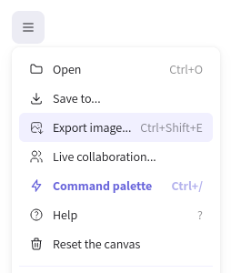

## Objectifs

* Connaître les différents types de maquettes
* Apprendre à composer une maquette d'interface web

## Introduction

En tant que développeur web, tu devras peut-être créer toi-même les maquettes de tes applications.

Même si tu as la chance d'avoir une personne qui fait du design dans ton équipe, c'est important que tu aies une base dans le domaine pour communiquer efficacement. C'est ce que tu vas pouvoir valider dans cette ressource.

Pourquoi les maquettes sont-elles importantes ? Imagine que tu construises une maison sans plan. Tu risques de faire face à de nombreux problèmes imprévus, de perdre du temps et de l'argent. De la même manière, une maquette te permet de planifier et d'anticiper les besoins et les défis avant de commencer le développement d'une application.

## Le brief

> Hello 👋,
>
> Notre nouveau client souhaite mettre à jour son site vitrine en ajoutant une page "À propos". Elle sera dédiée à l'histoire de l'entreprise familiale, et présentera les membres de l'équipe. Tu peux réaliser un premier wireframe de cette page "À propos" pour lui envoyer une proposition rapidement.
>
> La page doit obligatoirement inclure :
>
> * Une section sur **l'évolution et l'histoire de l'entreprise**
> * Une **présentation de l'équipe** avec nom, prénom, photo et intitulé du poste occupé pour chacun
> * Un **formulaire** pour prendre contact avec l'entreprise
>
> L'équipe design.

## Le debrief

Comme toujours, garde ce message sous la main : tu y trouveras des informations précieuses sur ce que tu dois faire.

Regardons maintenant en quoi consiste cette mission et comment la mener à bien.

### Qu'est-ce qu'une maquette ?

Une maquette ou prototype est un plan visuel de ton application. Comme pour la construction d'une maison, il est essentiel de faire un plan en amont pour valider ce que tu vas construire.

Un site web évolue tout au long de son développement. Tu devras maintenir à jour les maquettes lors du développement de nouvelles fonctionnalités. Le plan n'est pas définitif.
{:.alert-warning}

Ce plan peut être plus ou moins détaillé selon le temps que tu y consacres. 

La preuve en image :
[https://www.youtube.com/watch?v=x9wn633vl_c](https://www.youtube.com/watch?v=x9wn633vl_c)

### Types de maquettes

Tu dois connaître les différents types de maquettes et le vocabulaire associé. Voici les principaux types que tu rencontreras :

1. **Wireframe** : Maquette basse fidélité, souvent en noir et blanc, qui montre l'agencement général des éléments.
2. **Mockup** : Maquette haute fidélité qui inclut des détails visuels tels que les couleurs et la typographie.
3. **Prototype** : Maquette interactive qui permet de simuler l'expérience utilisateur finale.

Pour en savoir plus, consulte cette ressource :

- [Concevoir des prototypes](https://simplonco.github.io/design-concevoir-des-prototypes)

### Choisir un outil

Que tu aies du talent pour le dessin ou pas, tu sais depuis longtemps comment utiliser un papier et un crayon : ce sera toujours un excellent choix parce que tu n'auras rien à apprendre, et que tu auras très souvent tout le matériel sous la main.

Pour des maquettes basiques, tu peux utiliser [Excalidraw](https://excalidraw.com/) : c'est une version en ligne simple mais très puissante du papier et du crayon.

Et pour apprendre à l'utiliser en quelques secondes :

[Excalidraw - tutoriel 1](https://www.youtube.com/watch?v=MayTRZAh0QE)
[Excalidraw - tutoriel 2](https://www.youtube.com/watch?v=O1Kqxw07VWM)

### Composer ton interface

Une fois ton outil choisi, tu as besoin de connaître les différents composants que tu peux intégrer dans une interface :

1. **En-têtes et titres** : pour structurer l'information.
2. **Images et vidéos** : pour illustrer et dynamiser le contenu.
3. **Formulaires** : pour recueillir des informations des utilisateurs.
4. **Boutons et liens** : pour naviguer entre les différentes pages.

Pour approfondir la composition de ton interface :

- [Les composants d'interface utilisateur](https://simplonco.github.io/design-les-composants-dinterface-utilisateur/)

## Challenge

Exporte ta maquette depuis [Excalidraw](https://excalidraw.com/) si tu souhaites la partager. 

### Critères de validation

- [ ] La maquette est conforme au brief donné.

---

[Voir la solution](solution){:.alert-info}
