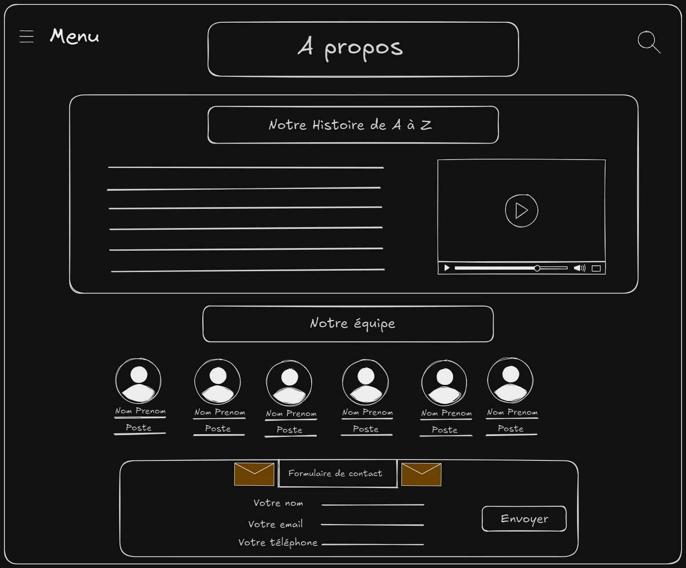
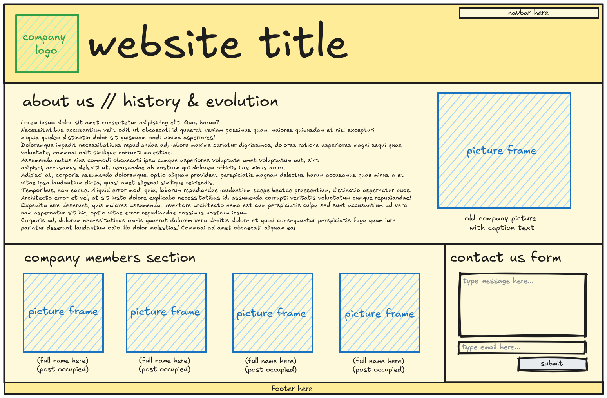
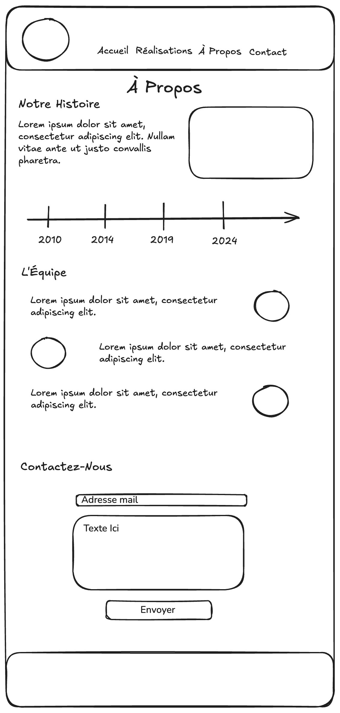

## Plusieurs solutions possibles

Chacune de ces propositions a été réalisée par des élèves en formation. Elles sont conformes au brief donné : une section sur l'évolution et l'histoire de l'entreprise, une présentation de l'équipe et un formulaire de contact.

### Stephen Bacher

Les différentes sections sont affichées en "pile" les unes en dessous des autres : c'est la manière la plus naturelle de faire. Des éléments clés déclencheront une réaction et un échange avec le client :

* la présence d'un menu et d'une option de recherche en haut à gauche et à droite du wireframe : que devrait contenir le menu ? À quoi peut amener une recherche sur le site ?
* la proposition d'une vidéo dans la section "Notre histoire" : est-ce que le client peut fournir des médias pour illustrer la page ? Est-ce que c'est une prestation à lui proposer ?

En cas de désapprobation du client, supprimer ces éléments conserve l'esprit et l'organisation du wireframe : ce sont des bonnes initiatives à proposer sans qu'elles prennent plus de place que la "vraie" proposition de design à faire valider par le client.

Merci à [Stephen Bacher](https://github.com/Stephen6Code) pour cette solution :)

### Julie Coulon

Le format wireframe est utilisé de façon intéressante : la couleur serait presque en trop pour respecter le cahier des charges d'un wireframe, mais l'utilisation de nuances de jaune pour le fond guide la lecture du titre vers les autres sections. La distinction vert/bleu entre les images et le logo a aussi un impact positif sur la lecture.

Les textes sont suffisamment neutres pour limiter les biais sur les images des membres de l'équipe. À l'inverse, la légende de la photo "historique" amène un parti pris en suggérant l'utilisation d'une vieille photo. C'est là aussi à la limite du wireframe, mais apporte une proposition concrète, pertinente et assez neutre pour ne pas remettre en question la totalité du wireframe en cas de refus du client.

Merci à [Julie Coulon](https://github.com/JlCln) pour cette solution :)

### Mickaël Girardet

Une proposition de design mobile : si le développement est recommandé en mobile first, c'est une contrainte forte pour le design avec une "toile" plus réduite pour exprimer son art. L'empilement des sections devient vraiment la norme.

Des éléments très visuels comme la timeline permettent de montrer l'information avec moins de texte. Sur la section de l'équipe, l'alternance gauche / droite des photos permet de casser la monotonie du scroll vertical.

La discrète zone vide en pied du wireframe laisse la porte ouverte pour discuter d'une barre avec des boutons, facilement accessible par le pouce avec le téléphone dans la main.

Merci à [Mickaël Girardet](https://github.com/michaelgirardet) pour cette solution :)
